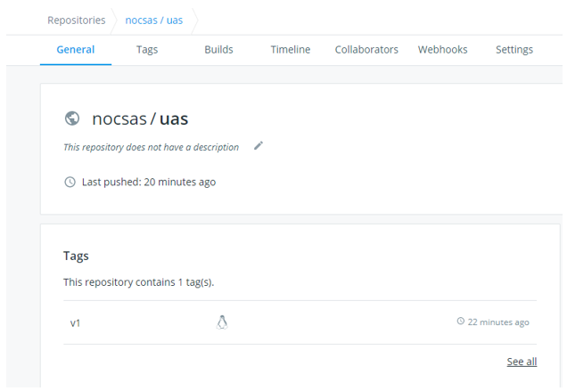
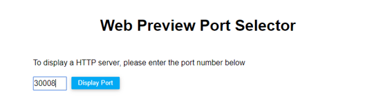
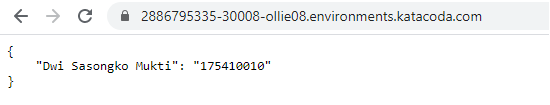

Nama : Dwi Sasongko Mukti  
Nim : 175410010  
Jurusan : Teknik Informatika  
==============

# Kubernetes + Docker + Python + Flask  
## Membuat Directory Dan Masuk Ke Directory  
    $ mkdir sas
    $ cd sas/

## Membuat File app.py  
    from flask import Flask
    from flask_restful import Resource, Api

    app = Flask(__name__)
    api = Api(app)

    class HelloWorld(Resource):
        def get(self):
            return {'Dwi Sasongko Mukti': '175410010'}

    api.add_resource(HelloWorld, '/')

    if __name__ == '__main__':
        app.run(debug=True, host='0.0.0.0')  

## Membuat File requirements.txt  
    flask  
    flask_restful  

## Membuat File Dockerfile Tanpa Extention  
    FROM python:2.7
    COPY . /app
    WORKDIR /app
    RUN pip install -r requirements.txt
    ENTRYPOINT ["python"]
    CMD ["app.py"]   

## Membuat Membuat Context Ke Docker Daemon    
    $ docker build -t nocsas/uas:v1 .
    Sending build context to Docker daemon  4.096kB
    Step 1/6 : FROM python:2.7
    2.7: Pulling from library/python
    8f0fdd3eaac0: Pull complete
    d918eaefd9de: Pull complete
    43bf3e3107f5: Pull complete
    27622921edb2: Pull complete
    dcfa0aa1ae2c: Pull complete
    ef6ca6913068: Pull complete
    a755ea00feee: Pull complete
    74b6f9ff9fd6: Pull complete
    bebb4b693476: Pull complete
    Digest: sha256:9517f5314968111658d229ed3038630a174e7a4f1b852bd185b70f614dffba08
    Status: Downloaded newer image for python:2.7
    ---> 426ba9523d99
    Step 2/6 : COPY . /app
    ---> 7fca109a4fdc
    Step 3/6 : WORKDIR /app
    ---> Running in 4efe58080279
    Removing intermediate container 4efe58080279
    ---> 18ac5432f380
    Step 4/6 : RUN pip install -r requirements.txt
    ---> Running in d8bc4a32afa2
    DEPRECATION: Python 2.7 will reach the end of its life on January 1st, 2020. Please upgrade your Python as Python 2.7 won't be maintained after that date. A future version of pip will drop support for Python 2.7. More details about Python 2 support in pip, can be found at https://pip.pypa.io/en/latest/development/release-process/#python-2-support
    Collecting flask
    Downloading https://files.pythonhosted.org/packages/9b/93/628509b8d5dc749656a9641f4caf13540e2cdec85276964ff8f43bbb1d3b/Flask-1.1.1-py2.py3-none-any.whl (94kB)
    Collecting flask_restful
    Downloading https://files.pythonhosted.org/packages/17/44/6e490150ee443ca81d5f88b61bb4bbb133d44d75b0b716ebe92489508da4/Flask_RESTful-0.3.7-py2.py3-none-any.whl
    Collecting click>=5.1
    Downloading https://files.pythonhosted.org/packages/fa/37/45185cb5abbc30d7257104c434fe0b07e5a195a6847506c074527aa599ec/Click-7.0-py2.py3-none-any.whl (81kB)
    Collecting Jinja2>=2.10.1
    Downloading https://files.pythonhosted.org/packages/65/e0/eb35e762802015cab1ccee04e8a277b03f1d8e53da3ec3106882ec42558b/Jinja2-2.10.3-py2.py3-none-any.whl (125kB)
    Collecting itsdangerous>=0.24
    Downloading https://files.pythonhosted.org/packages/76/ae/44b03b253d6fade317f32c24d100b3b35c2239807046a4c953c7b89fa49e/itsdangerous-1.1.0-py2.py3-none-any.whl
    Collecting Werkzeug>=0.15
    Downloading https://files.pythonhosted.org/packages/ce/42/3aeda98f96e85fd26180534d36570e4d18108d62ae36f87694b476b83d6f/Werkzeug-0.16.0-py2.py3-none-any.whl (327kB)
    Collecting aniso8601>=0.82
    Downloading https://files.pythonhosted.org/packages/eb/e4/787e104b58eadc1a710738d4e418d7e599e4e778e52cb8e5d5ef6ddd5833/aniso8601-8.0.0-py2.py3-none-any.whl (43kB)
    Collecting pytz
    Downloading https://files.pythonhosted.org/packages/e7/f9/f0b53f88060247251bf481fa6ea62cd0d25bf1b11a87888e53ce5b7c8ad2/pytz-2019.3-py2.py3-none-any.whl (509kB)
    Collecting six>=1.3.0
    Downloading https://files.pythonhosted.org/packages/65/26/32b8464df2a97e6dd1b656ed26b2c194606c16fe163c695a992b36c11cdf/six-1.13.0-py2.py3-none-any.whl
    Collecting MarkupSafe>=0.23
    Downloading https://files.pythonhosted.org/packages/fb/40/f3adb7cf24a8012813c5edb20329eb22d5d8e2a0ecf73d21d6b85865da11/MarkupSafe-1.1.1-cp27-cp27mu-manylinux1_x86_64.whl
    Installing collected packages: click, MarkupSafe, Jinja2, itsdangerous, Werkzeug, flask, aniso8601, pytz, six, flask-restful
    Successfully installed Jinja2-2.10.3 MarkupSafe-1.1.1 Werkzeug-0.16.0 aniso8601-8.0.0 click-7.0 flask-1.1.1 flask-restful-0.3.7 itsdangerous-1.1.0 pytz-2019.3 six-1.13.0
    Removing intermediate container d8bc4a32afa2
    ---> afe0633be996
    Step 5/6 : ENTRYPOINT ["python"]
    ---> Running in 7b47ab05caf0
    Removing intermediate container 7b47ab05caf0
    ---> 9fb8275a2d94
    Step 6/6 : CMD ["app.py"]
    ---> Running in a48360887cbf
    Removing intermediate container a48360887cbf
    ---> fdd246616a01
    Successfully built fdd246616a01
    Successfully tagged nocsas/uas:v1
 

## Masuk Ke Docker  
    $ docker login
    Login with your Docker ID to push and pull images from Docker Hub. If you don't have a Docker ID, head over to https://hub.docker.com to create one.
    Username: nocsas
    Password:
    WARNING! Your password will be stored unencrypted in /root/.docker/config.json.
    Configure a credential helper to remove this warning. See
    https://docs.docker.com/engine/reference/commandline/login/#credentials-store

    Login Succeeded

## Push Ke Repository Docker  
    $ docker push nocsas/uas:v1
    The push refers to repository [docker.io/nocsas/uas]
    028b2689efbc: Preparing
    138dc80e949e: Preparing
    028b2689efbc: Pushed
    03a3dc679282: Mounted from library/python
    35fc403d4c4c: Mounted from library/python
    c1fbc35a2660: Mounted from library/python
    f63773c65620: Mounted from library/python
    e6d60910d056: Mounted from library/python
    b52c1c103fae: Mounted from library/python
    6f1c84e6ec59: Mounted from library/python
    dd5242c2dc8a: Mounted from library/python
    v1: digest: sha256:d0b67b66329d2bbcd9515f8dac027dee07289095f838f89fbc331dd8990e2aa6 size: 2639

URL : https://hub.docker.com/repository/docker/nocsas/uas  

   

## Mendeploy Dengan Kubernetes  
    $ kubectl create deployment python-flask --image=nocsas/uas:v1
    deployment.apps/python-flask created

## Mengecek Deployments Sudah Ada Atau Belum Di Kubernetes  
    $ kubectl get deployments
    NAME           READY   UP-TO-DATE   AVAILABLE   AGE
    python-flask   1/1     1            1           22s

## Mengecek pods Sudah Running Atau Belum Di Kubernetes  
    $ kubectl get pods
    NAME                          READY   STATUS    RESTARTS   AGE
    python-flask-75ff7b68-zlx62   1/1     Running   0          47s

## Mengecek Deployment Sudah Terexpose atau Belum Di Kubernetes  
    $ kubectl expose deployment python-flask --type=LoadBalancer --port=5000
    service/python-flask exposed

## Mengecek Services Yang Ada Di Kubernetes 
    $ kubectl get services
    NAME           TYPE           CLUSTER-IP    EXTERNAL-IP   PORT(S)          AGE
    kubernetes     ClusterIP      10.96.0.1     <none>        443/TCP          16m
    python-flask   LoadBalancer   10.96.62.53   <pending>     5000:30008/TCP   20s

## Memasukkan Port Yang Ada Di Service Untuk Melihat Tampilan 
  

## Hasil Tampilan Yang Di Buat  
